# C64Emulator

A Commodore 64 emulator written in C# with an OpenTK/SharpPixels rendering frontend, SID audio output, IEC bus handling, savestates, and Commodore 1541 drive emulation.

Latest GitHub release: [C64Emulator 0.3.16](https://github.com/n1k0m0/C64Emulator/releases/tag/v0.3.16), including a self-contained Windows x64 setup package.

`SharpPixels` is my own small library for pixel-oriented games and Experiments based on OpenTK. It was inspired by the OneLoneCoder Pixel Game Engine and by Javidx9's excellent videos, which have been a wonderful source of motivation for approachable, hands-on graphics and emulator programming.

The original source code of my emulator started in 2017 as a welcome change of pace while I was writing my dissertation. That first version already supported the C64 ROMs, basic PRG loading, and an early working VIC-II implementation, but it was still far from a polished emulator. SID audio did not exist yet at all.

With the help of modern AI tooling, I have now returned to the project and expanded it substantially, as described below. For me, this emulator is about the joy of coding, the fun of exploring what current AI-assisted development makes possible, and, of course, the pleasure of playing with my beloved C64 again through an emulator of my own.

This project is not intended to replace the excellent VICE emulator in any way. Above all, it is a personal side project built for the fun of working on it. Perhaps it can also serve as a useful reference for people who are curious about writing their own emulator or exploring AI-assisted software development.

## Screenshots

| C64 boot screen | Main menu | Settings overlay | Controller mapping |
| --- | --- | --- | --- |
|  | 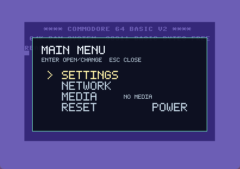 |  | 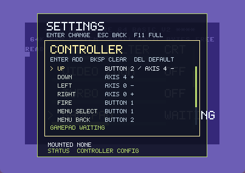 |

| Save/load overlay | Network overlay | Media browser |
| --- | --- | --- |
|  | 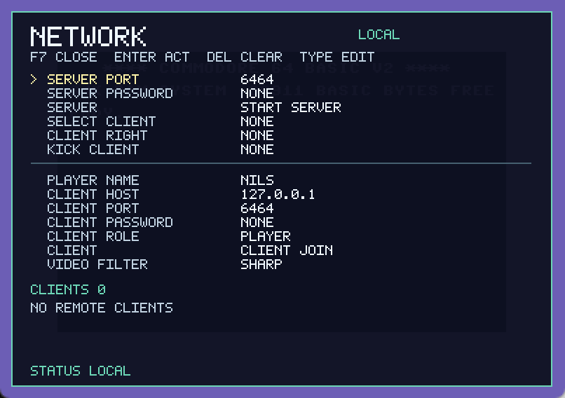 | 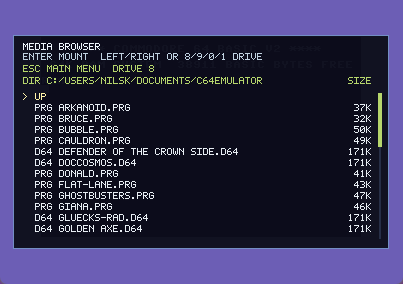 |

| Giana Sisters: intro | Giana Sisters: level 1 | Giana Sisters: end boss fight |
| --- | --- | --- |
|  |  | 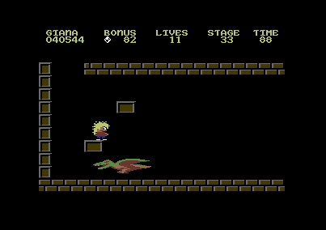 |

| Maniac Mansion: game start | Maniac Mansion: hallway | Maniac Mansion: front door |
| --- | --- | --- |
| 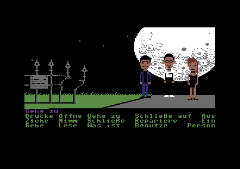 | 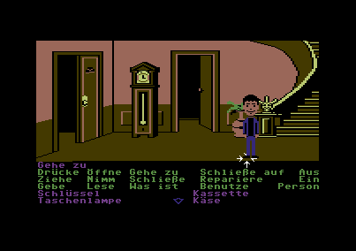 | 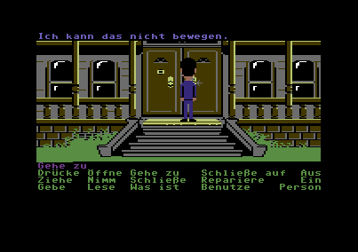 |

| Zak McKracken: apartment | Zak McKracken: bakery | Zak McKracken: airplane |
| --- | --- | --- |
| 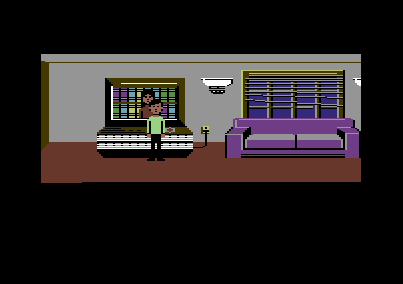 | 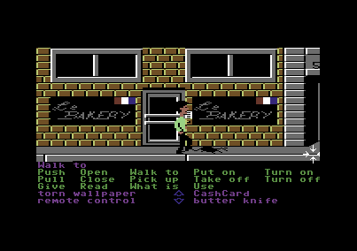 | 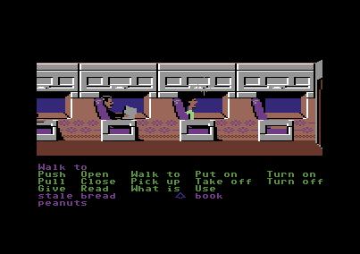 |

| Sonic: title screen | Sonic: Green Hill | Arkanoid: title screen |
| --- | --- | --- |
| 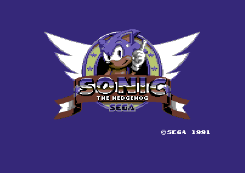 | 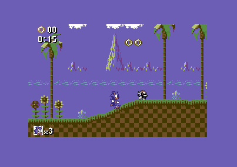 | 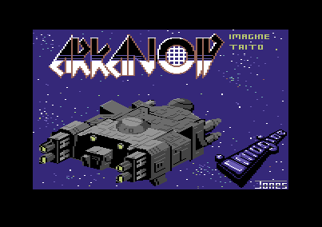 |

| Bubble Bobble: title screen | Bubble Bobble: in-game | Doc Cosmos |
| --- | --- | --- |
| 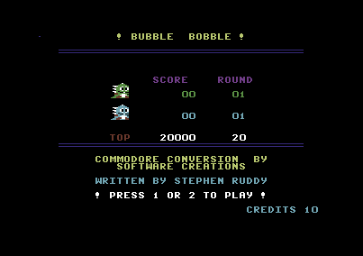 | 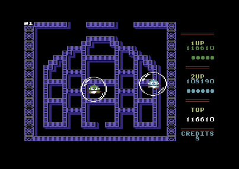 | 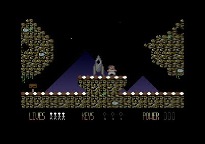 |

| Prince of Persia: cutscene | Prince of Persia: dungeon | Prince of Persia: palace | Prince of Persia: level 3 |
| --- | --- | --- | --- |
| 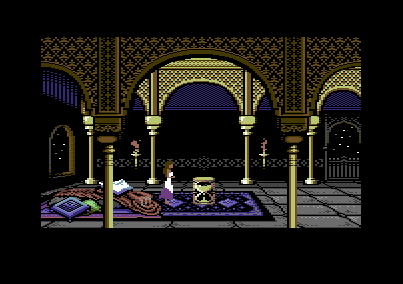 | 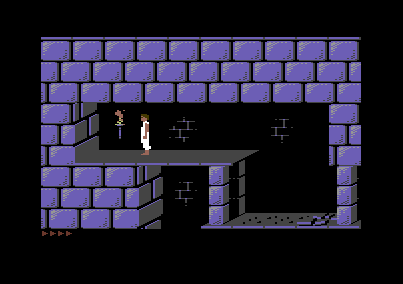 | 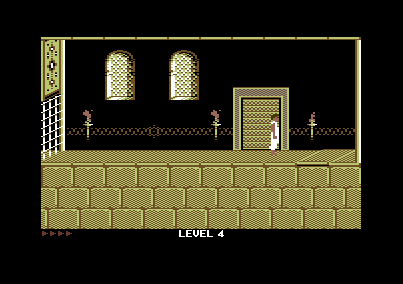 | 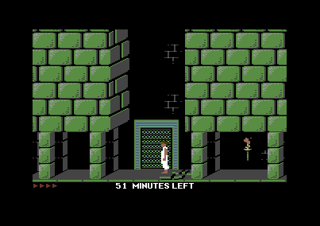 |


## Current Features

- MOS 6510 CPU emulation with cycle-oriented execution and support for the implemented official and illegal opcodes.
- VIC-II video output with raster timing, sprites, bitmap/text modes, scrolling, borders, PAL-oriented display timing, DMA-delay/FLI badline behavior, sprite DMA reuse timing, and sprite collision latching.
- SID register handling and audio output.
- CIA1/CIA2 emulation for keyboard, joystick, timers, interrupts, and IEC interaction.
- IEC bus infrastructure with emulated 1541-compatible drives on device numbers 8 to 11.
- D64 disk image mounting, PRG direct loading, EasyFlash `.crt` cartridge mounting, editable EasyFlash flash saves, and optional REU expansion RAM.
- Drag-and-drop mounting for `.prg`, `.d64`, and `.crt` media files.
- Multiple drive slots with per-drive activity LEDs in the footer overlay.
- Host gamepad support for joystick input, configurable controller bindings, controller-driven emulator menus, keyboard cursor/control mapping, and EN/GER host keyboard layout selection.
- Optional sharp-pixel, CRT, and TV-grille video presentation filters, GPU-side `SCALE2X`/`SCALE3X`/`HQ2X`/`HQ3X`/`HQ4X` upscalers, a local render FPS cap, and a local border-crop zoom.
- Savestates with complete emulator state, screenshot previews, load/delete support, and one-file save packages.
- Windowed/fullscreen controls, turbo mode, joystick port switching, reset mode selection, and runtime settings overlay.
- REU/REC emulation with 128 KB, 256 KB, 512 KB, 1 MB, 2 MB, 4 MB, 8 MB, and 16 MB capacities.
- Startup update check against the latest GitHub Release with a setup download progress window, optional SHA-256 verification, and safe setup launch after the emulator exits.
- Network multiplayer/remote-play sessions over mandatory TLS/TCP or optional Relay Mode: one host runs the C64, clients receive compressed live video/audio, can apply their own local video filter/upscale/zoom, and can send host-approved joystick/keyboard input or watch as observers.
- `SharpPixels`, a small pixel-buffer presentation library used by the emulator frontend.

## Controls

| Key | Action |
| --- | --- |
| `F1` - `F8` | C64 function keys. `F2` / `F4` / `F6` / `F8` are sent as shifted C64 function keys. |
| `F9` | Toggle turbo mode. |
| `F10` | Open the main emulator menu. From there you can open Settings, Network, Media, or Reset. The emulator pauses while a menu is open on the host. |
| `F11` | Toggle fullscreen mode. |
| `F12` | Open the savestate overlay. The emulator pauses while this menu is open. |
| Drag `.prg` / `.d64` / `.crt` onto the window | Load PRG directly, mount D64 into the currently selected target drive, or insert an EasyFlash cartridge. |
| Configured gamepad directions/buttons | C64 joystick direction/fire for the selected joystick port. |
| Configured gamepad menu buttons | Open/navigate emulator menus, activate entries, go back, or open savestates. |
| `Alt` + arrow keys | Send the C64 cursor keys without changing input modes. |
| `S` / `F5` in savestate menu | Create a new savestate. |
| `Enter` / `L` in savestate menu | Load the selected savestate and close the menu. |
| `Del` in savestate menu | Ask for confirmation and then delete the selected savestate. |
| `Esc` | Close the active emulator overlay or return from a F10 submenu to the F10 overview. |

## F10 Network Multiplayer Menu

Open the main menu with `F10` and choose `NETWORK` to manage multiplayer. In host mode, the local emulator keeps running the C64 simulation and streams the completed C64 frames plus live SID audio to connected clients. Clients do not run their own C64 while connected; they display the host frame stream, play the host audio, and optionally send host-approved joystick and keyboard input back to the host. C64Net connections always use TLS; LAN Mode uses direct emulator-to-emulator TLS and Relay Mode connects both sides through an optional public relay server so NAT and manual port forwarding are not required. Certificates are pinned on first use. If a pinned C64 server or relay certificate changes later, the network menu shows a warning with the old and new fingerprint and asks whether to replace the pinned id or abort.


The server always starts from the raw sharp C64 framebuffer. Each client can still choose its own local presentation filter (`SHARP`, `CRT`, or `TV`), source upscaler (`NONE`, `SCALE2X`, `SCALE3X`, `HQ2X`, `HQ3X`, or `HQ4X`), border-crop zoom, and fullscreen mode. Network video is sent at most once per completed PAL C64 frame, so the practical maximum is about 50 FPS for the current PAL model. Clients may render more often than network frames arrive; the latest received frame is reused locally between network updates. Unchanged frames are skipped, and changed frames are encoded as the smallest available full, sparse-delta, compressed sparse-delta, XOR/RLE-delta, or compressed XOR/RLE-delta payload. Live SID audio is sent as self-contained 4-bit IMA ADPCM packets, with PCM kept as a protocol fallback. Slow clients keep only the latest pending video frame and bounded audio data, so they do not stall faster clients. The title bar and network overlay show current TLS traffic, network FPS, render FPS, and round-trip ping; the host also shows per-client latency in the client list.

Transport details:

| Area | Behavior |
| --- | --- |
| Security | Every C64Net session uses TLS. LAN Mode pins the C64 server certificate for the selected host/port. Relay Mode pins the relay certificate and additionally encrypts the C64 session end to end between host emulator and client emulator. Certificate changes are shown as explicit old/new fingerprint warnings before a pin can be replaced. |
| Video source | The host sends the unfiltered sharp C64 image. Client-side `SHARP`, `CRT`, `TV`, `VIDEO UPSCALE`, fullscreen, and `VIDEO ZOOM` settings remain local. |
| Video compression | Frames are converted to the 16-color C64 palette and packed as 4-bit pixels. The protocol then picks the smallest full frame, sparse delta, Deflate-compressed sparse delta, XOR/RLE delta, or Deflate-compressed XOR/RLE delta. |
| Audio compression | SID audio uses 4-bit IMA ADPCM network packets so audio bandwidth is far below raw 16-bit PCM. |
| Flow control | The server reuses the prepared frame payload for all clients and each client queue keeps only the newest pending video frame. |
| Latency | Ping/pong probes run during the session. Clients show their RTT; the server title/header shows the average RTT and the client list shows per-client RTT. |

Server-side entries:

| Entry | Values / Action | Details |
| --- | --- | --- |
| `MODE` | `LAN` / `RELAY` | Chooses direct LAN hosting or outbound Relay Mode. |
| `SERVER PORT` / `RELAY PASSWORD` | TLS/TCP port or hidden text | In LAN Mode, this is the incoming C64Net server port. In Relay Mode, this becomes the optional password required by a protected relay server. |
| `SERVER PASSWORD` | `NONE` or hidden text | Optional session password. Password characters are shown as `*` in the menu. |
| `CONNECTION ID` | Text | Shared Relay Mode session id. The relay connects clients to the host registered with the same id. |
| `SERVER` | `START SERVER` / `STOP SERVER` | Starts or stops the host session. |
| `SELECT CLIENT` | Connected client | Selects a connected client by id, address, and player name. |
| `CLIENT RIGHT` | `NO JOYSTICK`, `JOYSTICK 1`, `JOYSTICK 2`, `BOTH JOYSTICKS` | Chooses whether the selected client may control a joystick port. |
| `KEYBOARD RIGHT` | `KEYBOARD` / `NO KEYBOARD` | Chooses whether the selected client may type on the host C64 keyboard matrix. This is independent from joystick rights. |
| `KICK CLIENT` | Connected client | Disconnects the selected client. Kicked clients cannot rejoin the same server session; restarting the server clears this session ban list. |

In Relay Mode, `RELAY PASSWORD` applies to both hosting and joining through the relay.

Client-side entries:

| Entry | Values / Action | Details |
| --- | --- | --- |
| `PLAYER NAME` | Text | Name announced to the host. The default is `player`. |
| `RELAY HOST` / `CLIENT HOST` | Host name or IP | Address of the relay in Relay Mode, or the direct C64 host in LAN Mode. |
| `RELAY PORT` / `CLIENT PORT` | TLS/TCP port | Relay TLS port in Relay Mode, or the direct host port in LAN Mode. The default relay port is `6465`. |
| `CLIENT PASSWORD` | `NONE` or hidden text | Password sent to the host, if the session uses one. |
| `CLIENT ROLE` | `PLAYER` / `OBSERVER` | Requested role. The host can still grant or remove joystick and keyboard rights after connection. |
| `CLIENT` | `CLIENT JOIN` / `CLIENT LEAVE` | Joins or leaves the host session. |
| `VIDEO FILTER` | `SHARP`, `CRT`, `TV` | Local-only filter used for the received server image. |
| `VIDEO UPSCALE` | `NONE`, `SCALE2X`, `SCALE3X`, `HQ2X`, `HQ3X`, `HQ4X` | Local-only GPU upscaler applied before the presentation filter. The F10 `VIDEO ZOOM` setting is also local and remains available on clients. |

Network menu controls:

| Key | Action |
| --- | --- |
| `Up` / `Down` | Move through network menu entries. |
| `Left` / `Right` | Adjust values, switch roles, cycle selected clients, or start/stop/join/leave where applicable. |
| `-` / `+` | Same as `Left` / `Right`. |
| `Enter` | Activate the selected entry. |
| `Del` | Clear editable text fields. |
| `Backspace` | Delete the previous character in editable text fields. |
| `Esc` | Return to the F10 overview. |

When the host is in a menu, connected clients receive a persistent popup such as `SERVER IN NETWORK MENU` or `SERVER IN SETTINGS MENU`, so observers and remote players know why the C64 picture is paused.

## Relay Server

Relay Mode is optional and is meant for sessions where the host cannot expose a LAN/TCP port directly. A public relay accepts one host registration per `CONNECTION ID` and forwards matching clients to that host. A relay server can require its own relay password before it accepts host or client registrations. After three wrong relay passwords from the same remote IP, that IP is ignored for 30 minutes. This relay password is separate from the C64Net session password; the relay still does not need the C64Net session password and does not decrypt the end-to-end C64 session stream.

The repository contains a small Python relay implementation in `relay_server/`. It listens on TLS port `6465` by default, creates or uses a self-signed relay certificate, writes normal logs, and includes Ubuntu `systemd` helper scripts:

```bash
cd relay_server
bash install_service.sh
sudo systemctl status c64-relay-server
bash remove_service.sh
```

The Windows installer does not ship or install the relay server. The relay is intended to be deployed separately on a domain or VPS. See [relay_server/README.md](relay_server/README.md) for the service configuration, log paths, and certificate options.

## F10 Main And Settings Menu

The `F10` overview contains `SETTINGS`, `NETWORK`, `MEDIA`, and `RESET`. The `MEDIA` row shows the currently mounted disk or media next to the entry. `Esc` from a submenu returns to this overview; `Esc` from the overview closes the emulator menu.


Top-level entries:

| Entry | Action |
| --- | --- |
| `SETTINGS` | Opens the runtime settings overlay. |
| `NETWORK` | Opens the multiplayer/network overlay. |
| `MEDIA` | Opens the media browser. The row also shows the currently mounted disk or `NO MEDIA`. |
| `RESET` | Opens the reset confirmation for the selected reset mode. |

Choose `SETTINGS` to open the runtime settings overlay. Emulation is paused while this menu is open, so it is safe to change audio, input, video, reset mode, and compatibility options without the machine continuing to run in the background.


Navigation inside the menu:

| Key | Action |
| --- | --- |
| `Up` / `Down` | Move through the menu entries. The menu scrolls when needed. |
| `Left` / `Right` | Adjust the selected value or trigger the selected toggle. |
| `-` / `+` | Same as `Left` / `Right` for adjustable settings. |
| `Enter` | Activate the selected entry. For simple toggles this changes the value. |
| `Esc` | Return to the F10 overview. |

Menu entries:

| Entry | Values / Action | Details |
| --- | --- | --- |
| `MASTER VOLUME` | Low to high | Controls the host-side SID output level. Use this to balance emulator audio against the Windows/system volume without changing the emulated program. |
| `NOISE LEVEL` | Soft to harsh | Adjusts the generated SID noise amount. Lower values are cleaner; higher values make noise-heavy effects more aggressive. |
| `SID MODEL` | `6581` / `8580` | Switches the SID character model. `6581` is the older, rougher sounding chip family; `8580` is cleaner and behaves differently for some filters and digi tricks. |
| `JOYSTICK` | `PORT 2`, `PORT 1`, `BOTH` | Selects which C64 joystick port receives keyboard/gamepad joystick input. Most C64 games use port 2, while some use port 1. `BOTH` mirrors input to both ports for convenience. |
| `KEYBOARD` | `EN` / `GER` | Selects the host keyboard layout used before PC keys are mapped to C64 keys. In `GER` mode, `Y`/`Z` and common German symbol chords such as `Shift+0` for `=` are mapped to the matching C64 matrix keys. Remote keyboard input is mapped on the client before it is sent to the host. |
| `DISPLAY` | `WINDOW` / `FULLSCREEN` | Toggles between windowed and fullscreen display mode. This is the same action as `F11`. |
| `RENDER FPS` | `60 HZ`, `120 HZ`, `UNLIMITED` | Caps the frontend render loop when `VSYNC` is off. This changes only how often the latest frame is drawn; C64 PAL timing, audio, and network frame production remain independent. |
| `VSYNC` | `OFF` / `ON` | Waits for the monitor vertical blank before swapping OpenGL buffers. This can remove horizontal tearing. While `VSYNC` is on, `RENDER FPS` is disabled because the display refresh controls presentation timing. |
| `VIDEO FILTER` | `SHARP`, `CRT`, `TV` | Selects the presentation filter. `SHARP` keeps crisp pixels, `CRT` adds subtle scanline/composite softness, and `TV` adds a very light grille-style texture. |
| `VIDEO UPSCALE` | `NONE`, `SCALE2X`, `SCALE3X`, `HQ2X`, `HQ3X`, `HQ4X` | Applies a GPU-side source upscaler before the selected `VIDEO FILTER`. This is local for normal, host, and network-client sessions. |
| `VIDEO ZOOM` | `OFF` / `ON` | Crops away the C64 border locally and scales the 320x200 inner display through the selected presentation filter. Hosts, clients, and local-only sessions can use different zoom settings. |
| `TURBO` | `OFF` / `MAX` | Toggles uncapped emulation speed for fast loading, testing, or skipping waits. This is the same action as `F9`. |
| `GAMEPAD` | `OFF`, `WAITING`, `ACTIVE` | Enables or disables host gamepad input. `Enter` opens the controller mapping submenu. The submenu can assign multiple buttons/axes to C64 joystick directions/fire, menu select/back, the main menu, turbo, and savestates. Freshly mapped or menu-used buttons are ignored for C64 gameplay until released, so menu input does not leak into the running game. |
| `LOAD HACK` | `OFF` / `ON` | Enables the direct KERNAL `LOAD` compatibility path. It improves convenience for simple loads, but is less hardware-faithful than pure IEC/drive behavior. |
| `IEC SOFTWARE` | `OFF` / `ON` | Toggles the high-level software IEC/DOS transport for standard disk traffic. This can improve compatibility for normal file access, while low-level custom loaders may still need more accurate 1541 behavior. |
| `INPUT INJECT` | `OFF` / `ON` | Enables host-side input injection for known intro/menu polling loops. This is a pragmatic compatibility helper, not original C64 hardware behavior. |
| `RESET MODE` | `WARM`, `RELOAD`, `POWER` | Chooses what the main menu `RESET` entry will do. `WARM` restarts the CPU while keeping RAM/media, `RELOAD` restarts and reloads mounted media, and `POWER` performs a fuller machine restart with media remounting. |
| `DRIVE OVERLAY` | `OFF` / `ON` | Shows or hides the drive activity footer. |
| `EASYFLASH` | `OFF` / `ON` | Enables or disables the inserted EasyFlash cartridge. |
| `EF SAVE` | `CLEAN`, `DIRTY`, `SAVE` | Saves flash changes back to the mounted `.crt` file when the cartridge has been modified by software. |
| `EF EJECT` | `EMPTY`, cartridge name | Ejects the inserted EasyFlash cartridge. |
| `REU` | `OFF` / `ON` | Enables or disables the emulated RAM Expansion Unit at I/O2 `$DF00-$DFFF`. |
| `REU SIZE` | `128KB` to `16MB` | Selects the REU capacity. Supported sizes are 128 KB, 256 KB, 512 KB, 1 MB, 2 MB, 4 MB, 8 MB, and 16 MB. |

The controller mapping submenu opened from `GAMEPAD` shows all joystick and menu actions. Each action can have multiple button, axis, or hat bindings.


The `MEDIA` browser opened from the F10 overview has its own controls:


| Key | Action |
| --- | --- |
| `Up` / `Down` | Select a directory or media file. |
| `PageUp` / `PageDown` | Jump by one visible page through long directories. |
| `A` - `Z` | Jump to the next entry whose real file/directory name starts with that letter. Repeating the same letter cycles through matching entries and wraps around. |
| `Enter` | Enter a directory or mount the selected `.prg`, `.d64`, or `.crt`. Mounting media returns to the F10 overview. |
| `Left` / `Right` | Change the target drive from 8 to 11. |
| `8` / `9` / `0` / `1` | Select target drive 8, 9, 10, or 11. |
| `Esc` | Return to the F10 overview. |

The main menu `RESET` entry opens a `YES` / `NO` confirmation for the selected reset mode. Use `Left` / `Right` to choose, `Enter` to confirm, or `Esc` to cancel and return to the F10 overview.

## Project Layout

```text
C64Emulator.sln
README.md
LICENSE
docs/
  screenshots/
  workflow notes and golden manifests
C64Emulator/
  C64Emulator.csproj
  C64Window.cs
  Program.cs
  Accuracy/      Built-in accuracy checks
  Machine/       C64 model, system coordinator, and memory bus
  Cartridge/     Cartridge images such as EasyFlash
  Expansion/     Expansion-port devices such as REU
  Cpu/           MOS 6510 CPU, instruction decoder, and trace helpers
  Vic/           VIC-II, video timing, bus planning, and framebuffer
  Sid/           SID emulation and audio output
  Cia/           CIA1/CIA2 peripheral chips
  DevTools/      Trace/export helpers for emulator development
  Golden/        Manifest-driven golden regression runner
  SaveStates/    Savestate format, migration, and serialization
  Input/         Joystick and host input mapping
  Media/         PRG loading, D64 parsing, and mounted media state
  Iec/           IEC bus and high-level drive protocol bridge
  Drive1541/     1541 drive hardware, VIA, bus, and disk mechanism
  Network/       C64Net TLS/TCP, Relay Mode, host server, and remote client transport
  Updates/       GitHub release startup update checker
  Properties/
relay_server/    Optional Python TLS relay and Ubuntu systemd service scripts
scripts/         Release, installer, golden-test, VICE-test, and fixture helpers
installer/       Inno Setup script for the Windows installer
SharpPixels/
  SharpPixels.csproj
  Input/         OpenTK input compatibility types used by the emulator
  Shaders/
```

## Requirements

- Windows.
- .NET 10 SDK or newer.
- Visual Studio or a compatible `dotnet` CLI/MSBuild installation with .NET 10 support.

## Dependencies

- `OpenTK` 4.9.4 for the OpenGL windowing/rendering path in `SharpPixels`.
- `NAudio` 2.3.0 for SID audio output.

## Build

```powershell
dotnet build C64Emulator.sln -c Release -p:Platform=x64
```

The executable is created at:

```text
C64Emulator/bin/x64/Release/C64Emulator.exe
```

## Windows Installer

The latest Windows setup can be downloaded from the [GitHub Releases](https://github.com/n1k0m0/C64Emulator/releases) page. The current release is `0.3.16`.

The installer build uses Inno Setup 6. If `ISCC.exe` is not available on the PATH, install it first:

```powershell
winget install --id JRSoftware.InnoSetup -e --accept-package-agreements --accept-source-agreements
```

Build the self-contained Windows publish folder and installer with:

```powershell
.\scripts\build-installer.ps1
```

The setup executable is written to:

```text
artifacts\installer\C64Emulator-<version>-win-x64-setup.exe
```

The setup wizard installs the emulator into `Program Files`, creates Start Menu entries, and can optionally create a desktop shortcut. When a previous installation is found, Setup asks whether the old application files should be removed before installing the new version. User data is kept during this update cleanup.

The uninstaller removes the installed application and `%APPDATA%\C64Emulator`, including downloaded ROMs, settings, and savestates. User-owned PRG and D64 media in `%USERPROFILE%\Documents\C64Emulator` are not removed by the uninstaller.

## Startup Updates

On normal GUI startup, the emulator checks the latest GitHub Release in the background after the window has opened. Headless diagnostic modes do not run this check. If a newer release exists and it contains a `*-win-x64-setup.exe` asset, the emulator shows an English update prompt: `A new version is available on GitHub.`

When the user accepts the update, a progress window downloads the setup to `%TEMP%\C64Emulator\updates`. The window shows progress, downloaded size, cancel/retry handling, and an `Install` button after a successful download. If GitHub provides a SHA-256 asset digest, the setup is verified before it can be launched. The emulator then closes cleanly and a small helper starts Setup only after the running emulator process has exited, so installed files can be replaced safely.

If GitHub is unreachable, no newer release exists, or the release does not contain a Windows setup asset, startup continues silently. Download or launch errors are only shown after the user has chosen to install the update.

## Diagnostics

The executable also exposes a few headless checks that are useful before accuracy or performance work:

```powershell
C64Emulator\bin\x64\Release\C64Emulator.exe --check-roms
C64Emulator\bin\x64\Release\C64Emulator.exe --self-test-cpu C64Emulator\bin\x64\Release\cpu_self_test.log
C64Emulator\bin\x64\Release\C64Emulator.exe --accuracy-tests C64Emulator\bin\x64\Release\accuracy_tests.log
C64Emulator\bin\x64\Release\C64Emulator.exe --migrate-savestates "%APPDATA%\C64Emulator\saves" "%APPDATA%\C64Emulator\saves\savestate-migration.log"
C64Emulator\bin\x64\Release\C64Emulator.exe --trace-cycles 20000 C64Emulator\bin\x64\Release\trace_cycles.csv 63
C64Emulator\bin\x64\Release\C64Emulator.exe --trace-machine 20000 C64Emulator\bin\x64\Release\trace_machine.jsonl 1
C64Emulator\bin\x64\Release\C64Emulator.exe --golden-run docs\golden-manifest.sample.json artifacts\golden
C64Emulator\bin\x64\Release\C64Emulator.exe --golden-accept docs\golden-manifest.sample.json artifacts\golden\golden-results.json artifacts\golden\accepted-manifest.json
C64Emulator\bin\x64\Release\C64Emulator.exe --golden-compare artifacts\reference\golden-results.json artifacts\candidate\golden-results.json artifacts\candidate\golden-compare.log
C64Emulator\bin\x64\Release\C64Emulator.exe --regression-run "" 500000 C64Emulator\bin\x64\Release\regression_boot.log C64Emulator\bin\x64\Release\regression_boot.ppm
C64Emulator\bin\x64\Release\C64Emulator.exe --render-savestate "%APPDATA%\C64Emulator\saves\example.c64sav" 1 C64Emulator\bin\x64\Release\savestate_frame.ppm
C64Emulator\bin\x64\Release\C64Emulator.exe --run-prg-sys tests\example.prg 0x080D 1000000 C64Emulator\bin\x64\Release\prg_sys.log
C64Emulator\bin\x64\Release\C64Emulator.exe --probe-run-d64 disks\example.d64 C64Emulator\bin\x64\Release\probe_run_d64.log
C64Emulator\bin\x64\Release\C64Emulator.exe --probe-iec-load disks\example.d64 C64Emulator\bin\x64\Release\probe_iec_load.log
C64Emulator\bin\x64\Release\C64Emulator.exe --probe-easyflash-input carts\example.crt C64Emulator\bin\x64\Release\easyflash_probe.log C64Emulator\bin\x64\Release\easyflash_probe.ppm
C64Emulator\bin\x64\Release\C64Emulator.exe --benchmark 2000000 C64Emulator\bin\x64\Release\benchmark.log
```

`--trace-machine` writes structured JSONL samples for cycle-accuracy work, including CPU bus accesses, VIC pipeline state, BA/AEC state, and 1541 scheduler state. `--golden-run` executes an external manifest and writes JSON plus JUnit XML results. `--golden-accept` refreshes manifest expectations from an accepted run, and `--golden-compare` compares two result JSON files. The probe commands are development helpers for PRG/SYS test programs, D64 boot/load behavior, savestate rendering, and EasyFlash input paths. The current cycle-accuracy implementation worklog is in `docs/cycle-accuracy-worklog.md`; the baseline workflow is described in `docs/golden-reference-workflow.md`.

For local accuracy work, the helper scripts in `scripts/` can run and compare imported VICE VIC-II and C64 test programs. Keep upstream test-suite directories such as `vice_VICII_tests` and `vice_testprogs` local; they are test inputs, not source files to redistribute in this repository.

```powershell
.\scripts\run-vice-vicii-tests.ps1 -IncludeDirectories border,D011Test,dentest,greydot -NoDiff
.\scripts\run-vice-c64-exitcode-tests.ps1 -TestRoot .\vice_testprogs -IncludeGroups CPU
.\scripts\compare-vicii-reference.ps1 -ReferenceFrame path\to\reference.png -EmulatorFrame path\to\frame.ppm -AutoAlign
.\scripts\run-savestate-golden-tests.ps1 -Accept -BaselinePath artifacts\savestate-golden-baseline.json
.\scripts\run-savestate-golden-tests.ps1 -BaselinePath artifacts\savestate-golden-baseline.json
```

`run-savestate-golden-tests.ps1` renders every local `.c64sav` below `%APPDATA%\C64Emulator\saves`.
Use `-Accept` to create or refresh a local hash baseline, then run without `-Accept` to fail on render errors,
missing saves, new saves, or framebuffer hash changes.

For a single Phase 1 smoke run after a Release build:

```powershell
.\scripts\run-phase1-checks.ps1
```

For the Phase 3 accuracy smoke suite:

```powershell
.\scripts\run-phase3-checks.ps1
```

For the Phase 4 developer-tool smoke suite:

```powershell
.\scripts\run-phase4-checks.ps1
```

The drive activity footer can be toggled through the `DRIVE OVERLAY` entry in the `F10` settings menu.

## Media Handling

PRG files are loaded directly into C64 memory. D64 files are mounted into an emulated 1541 drive and accessed through the IEC path instead of being injected into RAM. EasyFlash `.crt` images are inserted through the cartridge expansion-port path and can be enabled, disabled, saved, or ejected from the settings overlay. Other CRT cartridge types are not treated as generic cartridges yet; the current cartridge loader expects EasyFlash CRT images.

Drive 8 is the default drive. Drives 9, 10, and 11 can also be used from the emulator menu when media is mounted for them. Idle drives are kept quiet unless a disk image is mounted.

Media can be selected from the `MEDIA` entry in the `F10` main menu or dropped directly onto the emulator window. The default user media directory is `%USERPROFILE%\Documents\C64Emulator`; the emulator creates it on demand and remembers the last media browser directory. The media browser shows file sizes, includes a proportional scrollbar for long directories, supports page jumps, and supports first-letter navigation. Dropped D64 images use the menu's current target drive.

The D64 parser handles the common 35-track layout and extended image sizes where supported by the image parser. Some copy-protected titles or custom fast loaders can still expose gaps in the current 1541 accuracy work.

## REU Expansion

The optional REU emulates the MOS 8726 RAM Expansion Controller register window at `$DF00-$DF0A`, including the mirrored register layout across I/O2. It supports C64-to-REU, REU-to-C64, swap, and verify commands, autoload, delayed `$FF00` triggering, fixed C64/REU address modes, end/fault status bits, and IRQ status masking.

Transfers run as DMA: the CPU is held while the REC consumes available CPU bus cycles, and the transfer pauses when the VIC owns the bus. The transfer captures the active C64 memory configuration when the command starts, so software can use the usual `$FF00` path to reach RAM below ROM or I/O. REU RAM is stored in savestates and survives emulator resets while the controller registers reset like hardware.

## Savestates

Savestates are stored as individual files in `%APPDATA%\C64Emulator\saves`. A savestate contains the C64 machine state, chip state, mounted drive state, metadata, and a screenshot preview used by the `F12` overlay. Deleting a savestate always opens a `YES` / `NO` confirmation first. If the delete leaves a per-title save folder empty, that folder is removed automatically while the top-level save root is kept.


Savestate menu controls:

| Key | Action |
| --- | --- |
| `Up` / `Down` | Select a savestate. |
| `S` / `F5` | Create a new savestate. |
| `Enter` / `L` | Load the selected savestate and close the menu after a successful load. |
| `Del` | Open the delete confirmation for the selected savestate. |
| `Esc` | Close the savestate menu, or cancel the delete confirmation. |

## Settings

Runtime settings are stored in `%APPDATA%\C64Emulator\settings.json`. The file remembers user-facing options such as SID volume/model, joystick port, host keyboard layout, render FPS cap, video filter, video upscale, video zoom, fullscreen mode, turbo mode, gamepad input and controller bindings, reset mode, drive overlay visibility, EasyFlash enable/path, REU enable/size, compatibility toggles, the media browser target drive, and the last media browser directory. The network menu also persists LAN/Relay mode, server/client/relay ports, the connection id, the last host, optional session and relay passwords, the player name, and the requested client role. Mounted disk/program files and active network sessions are intentionally not persisted, so the emulator always starts without re-opening ordinary disk/program files or rejoining a previous server. An inserted EasyFlash image path is persisted separately because it behaves like a cartridge expansion device.

## ROM Files

The emulator expects the required C64 and 1541 ROM binary files in `%APPDATA%\C64Emulator\roms`. ROM files in the application/build directory are still accepted for development builds, but the per-user AppData directory is the preferred location for normal use.

On GUI startup, the emulator checks whether the required ROM files can be found. If one or more files are missing, it offers to download the reference ROMs from zimmers.net into `%APPDATA%\C64Emulator\roms`, shows a separate progress bar for each missing file, verifies the SHA-256 checksum, and saves the downloaded files under the local emulator file names listed below. After a successful download, the dialog waits for the user to continue; after an error, the user can retry or cancel, which exits the emulator startup.

The currently expected ROM files correspond to these reference files:

| Local file | Reference file | Source URL | SHA-256 |
| --- | --- | --- | --- |
| `c64-basic-kernal.bin` | `64c.251913-01.bin` | <https://www.zimmers.net/anonftp/pub/cbm/firmware/computers/c64/64c.251913-01.bin> | `64E40E09124FC452AE97C83A880B82C912C4F7F74A1156C76963E4FF3717DE13` |
| `c64-character.bin` | `characters.901225-01.bin` | <https://www.zimmers.net/anonftp/pub/cbm/firmware/computers/c64/characters.901225-01.bin> | `FD0D53B8480E86163AC98998976C72CC58D5DD8EB824ED7B829774E74213B420` |
| `1541-c000-rom.bin` | `1541-c000.325302-01.bin` | <https://www.zimmers.net/anonftp/pub/cbm/firmware/drives/new/1541/1541-c000.325302-01.bin> | `6FA7B07AFF92DA66B0A28A52BB3C82FFE310AB0FAD2CC473B40137A8D299C7E5` |
| `1541-e000-rom.bin` | `1541-e000.901229-01.bin` | <https://www.zimmers.net/anonftp/pub/cbm/firmware/drives/new/1541/1541-e000.901229-01.bin> | `1B216F85C6FDD91B91BFD256AFFD9661D79FA411441A57D728D113ECF5B5451B` |

The source directory listings are available at:

- <https://www.zimmers.net/anonftp/pub/cbm/firmware/computers/c64/>
- <https://www.zimmers.net/anonftp/pub/cbm/firmware/drives/new/1541/>

ROM images and disk/program media are not covered by the source-code license. Check the rights for those files before publishing or redistributing a repository or build package.

## Status

The emulator is already useful for BASIC, PRG loading, D64 directory access, several games, savestates, EasyFlash titles, REU-aware software, and interactive testing. Recent VIC-II work improved display-mode latch timing, invalid display mode behavior, DMA-delay/FLI badlines, tightly multiplexed sprite reuse, and sprite-sprite collision latching outside the active display area. Cycle accuracy, remaining VIC-II edge cases, detailed REU/VIC DMA edge cases, and 1541 custom loader compatibility remain the main long-term accuracy areas.

## License

The emulator source code is licensed under the Apache License, Version 2.0. See [LICENSE](LICENSE).
