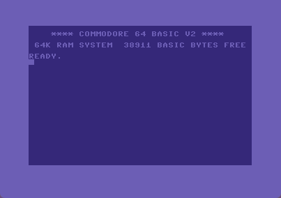
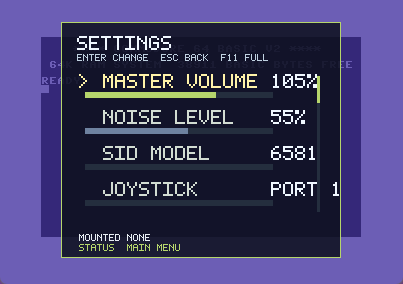
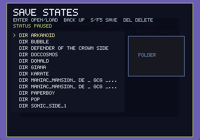
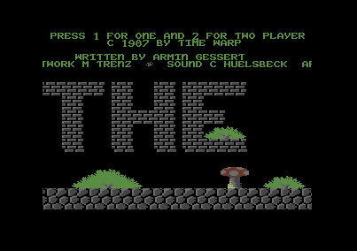
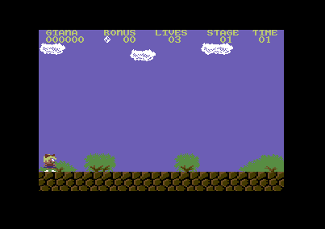

# C64Emulator

A Commodore 64 emulator written in C# with an OpenTK/SharpPixels rendering frontend, SID audio output, IEC bus handling, savestates, and Commodore 1541 drive emulation.

`SharpPixels` is my own small library for pixel-oriented games and Experiments based on OpenTK. It was inspired by the OneLoneCoder Pixel Game Engine and by Javidx9's excellent videos, which have been a wonderful source of motivation for approachable, hands-on graphics and emulator programming.

The original source code of my emulator started in 2017 as a welcome change of pace while I was writing my dissertation. That first version already supported the C64 ROMs, basic PRG loading, and an early working VIC-II implementation, but it was still far from a polished emulator. SID audio did not exist yet at all.

With the help of modern AI tooling, I have now returned to the project and expanded it substantially, as described below. For me, this emulator is about the joy of coding, the fun of exploring what current AI-assisted development makes possible, and, of course, the pleasure of playing with my beloved C64 again through an emulator of my own.

This project is not intended to replace the excellent VICE emulator in any way. Above all, it is a personal side project built for the fun of working on it. Perhaps it can also serve as a useful reference for people who are curious about writing their own emulator or exploring AI-assisted software development.

## Screenshots

| C64 boot screen | Settings overlay | Save/load overlay |
| --- | --- | --- |
|  |  |  |

| Giana Sisters intro | Giana Sisters level 1 |
| --- | --- |
|  |  |

## Current Features

- MOS 6510 CPU emulation with cycle-oriented execution and support for the implemented official and illegal opcodes.
- VIC-II video output with raster timing, sprites, bitmap/text modes, scrolling, borders, and PAL-oriented display timing.
- SID register handling and audio output.
- CIA1/CIA2 emulation for keyboard, joystick, timers, interrupts, and IEC interaction.
- IEC bus infrastructure with emulated 1541-compatible drives on device numbers 8 to 11.
- D64 disk image mounting and PRG direct loading.
- Drag-and-drop mounting for `.prg` and `.d64` media files.
- Multiple drive slots with per-drive activity LEDs in the footer overlay.
- Host gamepad support for joystick input, alongside keyboard cursor/control mapping.
- Optional sharp-pixel, CRT, and TV-grille video presentation filters.
- Savestates with complete emulator state, screenshot previews, load/delete support, and one-file save packages.
- Windowed/fullscreen controls, turbo mode, joystick port switching, reset mode selection, and runtime settings overlay.
- `SharpPixels`, a small pixel-buffer presentation library used by the emulator frontend.

## Controls

| Key | Action |
| --- | --- |
| `F8` | Toggle the drive activity footer overlay. |
| `F9` | Toggle turbo mode. |
| `F10` | Open the settings/media overlay. The emulator pauses while this menu is open. |
| `F11` | Toggle fullscreen mode. |
| `F12` | Open the savestate overlay. The emulator pauses while this menu is open. |
| Drag `.prg` / `.d64` onto the window | Load PRG directly or mount D64 into the currently selected target drive. |
| Gamepad left stick / D-pad | C64 joystick direction for the selected joystick port. |
| Gamepad A/B/RB | C64 joystick fire. |
| `S` / `F5` in savestate menu | Create a new savestate. |
| `Enter` / `L` in savestate menu | Load the selected savestate. |
| `Del` in savestate menu | Delete the selected savestate. |
| `Esc` | Close the active emulator overlay. |

## F10 Settings Menu

`F10` opens the main runtime settings overlay. Emulation is paused while this menu is open, so it is safe to change media, reset behavior, input, video, and compatibility options without the machine continuing to run in the background.

Navigation inside the menu:

| Key | Action |
| --- | --- |
| `Up` / `Down` | Move through the menu entries. The menu scrolls when needed. |
| `Left` / `Right` | Adjust the selected value or trigger the selected toggle. |
| `-` / `+` | Same as `Left` / `Right` for adjustable settings. |
| `Enter` | Activate the selected entry. For simple toggles this changes the value; for `MEDIA` and `RESET` it opens the related sub-menu. |
| `Esc` | Close the settings menu and resume emulation. |

Menu entries:

| Entry | Values / Action | Details |
| --- | --- | --- |
| `MASTER VOLUME` | Low to high | Controls the host-side SID output level. Use this to balance emulator audio against the Windows/system volume without changing the emulated program. |
| `NOISE LEVEL` | Soft to harsh | Adjusts the generated SID noise amount. Lower values are cleaner; higher values make noise-heavy effects more aggressive. |
| `SID MODEL` | `6581` / `8580` | Switches the SID character model. `6581` is the older, rougher sounding chip family; `8580` is cleaner and behaves differently for some filters and digi tricks. |
| `JOYSTICK` | `PORT 2`, `PORT 1`, `BOTH` | Selects which C64 joystick port receives keyboard/gamepad joystick input. Most C64 games use port 2, while some use port 1. `BOTH` mirrors input to both ports for convenience. |
| `MEDIA` | Browse / mounted media label | Opens the media browser with `Enter` or `Right`. `Left` ejects the currently mounted media. The browser can mount `.prg` and `.d64` files. |
| `DISPLAY` | `WINDOW` / `FULLSCREEN` | Toggles between windowed and fullscreen display mode. This is the same action as `F11`. |
| `VIDEO FILTER` | `SHARP`, `CRT`, `TV` | Selects the presentation filter. `SHARP` keeps crisp pixels, `CRT` adds subtle scanline/composite softness, and `TV` adds a very light grille-style texture. |
| `TURBO` | `OFF` / `MAX` | Toggles uncapped emulation speed for fast loading, testing, or skipping waits. This is the same action as `F9`. |
| `GAMEPAD` | `OFF`, `WAITING`, `ACTIVE` | Enables or disables host gamepad input. `WAITING` means gamepad support is on but no active pad input has been detected yet; `ACTIVE` means a pad is connected/seen. |
| `LOAD HACK` | `OFF` / `ON` | Enables the direct KERNAL `LOAD` compatibility path. It improves convenience for simple loads, but is less hardware-faithful than pure IEC/drive behavior. |
| `IEC SOFTWARE` | `OFF` / `ON` | Toggles the high-level software IEC/DOS transport for standard disk traffic. This can improve compatibility for normal file access, while low-level custom loaders may still need more accurate 1541 behavior. |
| `INPUT INJECT` | `OFF` / `ON` | Enables host-side input injection for known intro/menu polling loops. This is a pragmatic compatibility helper, not original C64 hardware behavior. |
| `RESET MODE` | `WARM`, `RELOAD`, `POWER` | Chooses what the `RESET` entry will do. `WARM` restarts the CPU while keeping RAM/media, `RELOAD` restarts and reloads mounted media, and `POWER` performs a fuller machine restart with media remounting. |
| `DRIVE OVERLAY` | `OFF` / `ON` | Shows or hides the drive activity footer. This is the same action as `F8`. |
| `RESET` | Confirmation dialog | Opens a confirmation prompt for the selected reset mode. Use `Left` / `Right` to choose `YES` or `NO`, `Enter` to confirm, and `Esc` / `Backspace` to cancel. |

The `MEDIA` browser opened from the F10 menu has its own controls:

| Key | Action |
| --- | --- |
| `Up` / `Down` | Select a directory or media file. |
| `Enter` | Enter a directory or mount the selected `.prg` / `.d64`. |
| `Backspace` | Go to the parent directory. |
| `Left` / `Right` | Change the target drive from 8 to 11. |
| `8` / `9` / `0` / `1` | Select target drive 8, 9, 10, or 11. |
| `Esc` | Close the media browser and return to the F10 menu. |

## Project Layout

```text
C64Emulator.sln
README.md
LICENSE
docs/
  screenshots/
C64Emulator/
  C64Emulator.csproj
  C64Window.cs
  Program.cs
  Machine/       C64 model, system coordinator, and memory bus
  Cpu/           MOS 6510 CPU, instruction decoder, and trace helpers
  Vic/           VIC-II, video timing, bus planning, and framebuffer
  Sid/           SID emulation and audio output
  Cia/           CIA1/CIA2 peripheral chips
  Input/         Joystick and host input mapping
  Media/         PRG loading, D64 parsing, and mounted media state
  Iec/           IEC bus and high-level drive protocol bridge
  Drive1541/     1541 drive hardware, VIA, bus, and disk mechanism
  Properties/
SharpPixels/
  SharpPixels.csproj
  Input/         OpenTK input compatibility types used by the emulator
  Shaders/
```

## Requirements

- Windows.
- .NET 10 SDK or newer.
- Visual Studio or a compatible `dotnet` CLI/MSBuild installation with .NET 10 support.

## Dependencies

- `OpenTK` 4.9.4 for the OpenGL windowing/rendering path in `SharpPixels`.
- `NAudio` 2.3.0 for SID audio output.

## Build

```powershell
dotnet build C64Emulator.sln -c Release -p:Platform=x64
```

The executable is created at:

```text
C64Emulator/bin/x64/Release/C64Emulator.exe
```

## Windows Installer

The installer build uses Inno Setup 6. If `ISCC.exe` is not available on the PATH, install it first:

```powershell
winget install --id JRSoftware.InnoSetup -e --accept-package-agreements --accept-source-agreements
```

Build the self-contained Windows publish folder and installer with:

```powershell
.\scripts\build-installer.ps1
```

The setup executable is written to:

```text
artifacts\installer\C64Emulator-<version>-win-x64-setup.exe
```

The setup wizard installs the emulator into `Program Files`, creates Start Menu entries, and can optionally create a desktop shortcut. When a previous installation is found, Setup asks whether the old application files should be removed before installing the new version. User data is kept during this update cleanup.

The uninstaller removes the installed application and `%APPDATA%\C64Emulator`, including downloaded ROMs, settings, and savestates. User-owned PRG and D64 media in `%USERPROFILE%\Documents\C64Emulator` are not removed by the uninstaller.

## Diagnostics

The executable also exposes a few headless checks that are useful before accuracy or performance work:

```powershell
C64Emulator\bin\x64\Release\C64Emulator.exe --check-roms
C64Emulator\bin\x64\Release\C64Emulator.exe --self-test-cpu C64Emulator\bin\x64\Release\cpu_self_test.log
C64Emulator\bin\x64\Release\C64Emulator.exe --accuracy-tests C64Emulator\bin\x64\Release\accuracy_tests.log
C64Emulator\bin\x64\Release\C64Emulator.exe --trace-cycles 20000 C64Emulator\bin\x64\Release\trace_cycles.csv 63
C64Emulator\bin\x64\Release\C64Emulator.exe --trace-machine 20000 C64Emulator\bin\x64\Release\trace_machine.jsonl 1
C64Emulator\bin\x64\Release\C64Emulator.exe --golden-run docs\golden-manifest.sample.json artifacts\golden
C64Emulator\bin\x64\Release\C64Emulator.exe --golden-accept docs\golden-manifest.sample.json artifacts\golden\golden-results.json artifacts\golden\accepted-manifest.json
C64Emulator\bin\x64\Release\C64Emulator.exe --golden-compare artifacts\reference\golden-results.json artifacts\candidate\golden-results.json artifacts\candidate\golden-compare.log
C64Emulator\bin\x64\Release\C64Emulator.exe --regression-run "" 500000 C64Emulator\bin\x64\Release\regression_boot.log C64Emulator\bin\x64\Release\regression_boot.ppm
C64Emulator\bin\x64\Release\C64Emulator.exe --benchmark 2000000 C64Emulator\bin\x64\Release\benchmark.log
```

`--trace-machine` writes structured JSONL samples for cycle-accuracy work, including CPU bus accesses, VIC pipeline state, BA/AEC state, and 1541 scheduler state. `--golden-run` executes an external manifest and writes JSON plus JUnit XML results. `--golden-accept` refreshes manifest expectations from an accepted run, and `--golden-compare` compares two result JSON files. The current cycle-accuracy implementation worklog is in `docs/cycle-accuracy-worklog.md`; the baseline workflow is described in `docs/golden-reference-workflow.md`.

For a single Phase 1 smoke run after a Release build:

```powershell
.\scripts\run-phase1-checks.ps1
```

For the Phase 3 accuracy smoke suite:

```powershell
.\scripts\run-phase3-checks.ps1
```

For the Phase 4 developer-tool smoke suite:

```powershell
.\scripts\run-phase4-checks.ps1
```

The drive activity footer can be toggled with `F8` or through the `DRIVE OVERLAY` entry in the `F10` settings menu.

## Media Handling

PRG files are loaded directly into C64 memory. D64 files are mounted into an emulated 1541 drive and accessed through the IEC path instead of being injected into RAM.

Drive 8 is the default drive. Drives 9, 10, and 11 can also be used from the emulator menu when media is mounted for them. Idle drives are kept quiet unless a disk image is mounted.

Media can be selected from the `F10` browser or dropped directly onto the emulator window. The default user media directory is `%USERPROFILE%\Documents\C64Emulator`; the emulator creates it on demand and remembers the last media browser directory. Dropped D64 images use the menu's current target drive.

The D64 parser handles the common 35-track layout and extended image sizes where supported by the image parser. Some copy-protected titles or custom fast loaders can still expose gaps in the current 1541 accuracy work.

## Savestates

Savestates are stored as individual files in `%APPDATA%\C64Emulator\saves`. A savestate contains the C64 machine state, chip state, mounted drive state, metadata, and a screenshot preview used by the `F12` overlay.

## Settings

Runtime settings are stored in `%APPDATA%\C64Emulator\settings.json`. The file remembers user-facing options such as SID volume/model, joystick port, video filter, fullscreen mode, turbo mode, gamepad input, reset mode, drive overlay visibility, compatibility toggles, the media browser target drive, and the last media browser directory. Mounted media files are intentionally not persisted, so the emulator always starts without re-opening disk or program files from a previous session.

## ROM Files

The emulator expects the required C64 and 1541 ROM binary files in `%APPDATA%\C64Emulator\roms`. ROM files in the application/build directory are still accepted for development builds, but the per-user AppData directory is the preferred location for normal use.

On GUI startup, the emulator checks whether the required ROM files can be found. If one or more files are missing, it offers to download the reference ROMs from zimmers.net into `%APPDATA%\C64Emulator\roms`, shows a separate progress bar for each missing file, verifies the SHA-256 checksum, and saves the downloaded files under the local emulator file names listed below. After a successful download, the dialog waits for the user to continue; after an error, the user can retry or cancel, which exits the emulator startup.

The currently expected ROM files correspond to these reference files:

| Local file | Reference file | Source URL | SHA-256 |
| --- | --- | --- | --- |
| `c64-basic-kernal.bin` | `64c.251913-01.bin` | <https://www.zimmers.net/anonftp/pub/cbm/firmware/computers/c64/64c.251913-01.bin> | `64E40E09124FC452AE97C83A880B82C912C4F7F74A1156C76963E4FF3717DE13` |
| `c64-character.bin` | `characters.901225-01.bin` | <https://www.zimmers.net/anonftp/pub/cbm/firmware/computers/c64/characters.901225-01.bin> | `FD0D53B8480E86163AC98998976C72CC58D5DD8EB824ED7B829774E74213B420` |
| `1541-c000-rom.bin` | `1541-c000.325302-01.bin` | <https://www.zimmers.net/anonftp/pub/cbm/firmware/drives/new/1541/1541-c000.325302-01.bin> | `6FA7B07AFF92DA66B0A28A52BB3C82FFE310AB0FAD2CC473B40137A8D299C7E5` |
| `1541-e000-rom.bin` | `1541-e000.901229-01.bin` | <https://www.zimmers.net/anonftp/pub/cbm/firmware/drives/new/1541/1541-e000.901229-01.bin> | `1B216F85C6FDD91B91BFD256AFFD9661D79FA411441A57D728D113ECF5B5451B` |

The source directory listings are available at:

- <https://www.zimmers.net/anonftp/pub/cbm/firmware/computers/c64/>
- <https://www.zimmers.net/anonftp/pub/cbm/firmware/drives/new/1541/>

ROM images and disk/program media are not covered by the source-code license. Check the rights for those files before publishing or redistributing a repository or build package.

## Status

The emulator is already useful for BASIC, PRG loading, D64 directory access, several games, savestates, and interactive testing. Cycle accuracy, VIC-II edge cases, and 1541 custom loader compatibility remain the main long-term accuracy areas.

## License

The emulator source code is licensed under the Apache License, Version 2.0. See [LICENSE](LICENSE).
